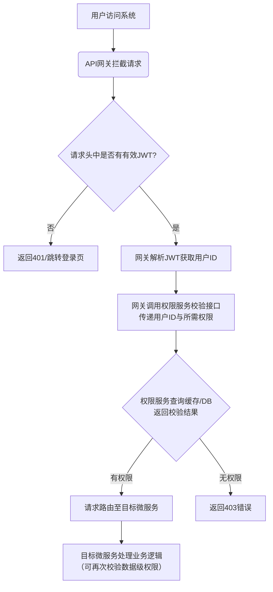

### 用户与权限服务

#### 模块功能定位

整个平台的**身份认证与权限基石**。本服务是整个平台的**认证授权中心（Auth Center）**。它负责所有用户身份的合法性验证，并为用户访问平台资源、执行操作提供统一的权限管控。其核心目标是**确保正确的人，以正确的角色，访问正确的资源**，实现师生账号的管理。

**用户故事**：

- **作为一名新入学的研究生**，我希望通过我的学校邮箱进行注册和验证，以便快速加入我导师的科研团队，开始我的研究工作。
- **作为一名团队负责人**，我希望能够管理我团队内的成员角色（如设置为“开发”或“文档”角色），以便控制他们对项目敏感操作的权限。
- **作为一名通用成员**，当我忘记密码时，我希望可以通过邮箱安全地重置我的密码，以便重新获得账户的访问权限。
- **作为一名系统管理员**，我希望有一个统一的界面来管理所有用户账户和平台级的角色权限，以便维护系统的秩序和安全。

#### 模块拥有的功能和解决的需求

- **用户注册**：
    - **需求**：解决“身份初始化管理”痛点，确保用户身份真实可溯。
    - **所有功能**：采用“**邮箱（域名可白名单校验）** + **验证码**”机制注册。用户需设置密码（6-16位，数字、字母或组合）并填写必填的基础信息（如姓名、单位）。
- **用户登录**：
    - **需求**：解决“安全便捷访问系统”的需求。
    - **所有功能**：支持“邮箱+密码”，“用户名+密码”等多种方式登录。未来可能接入学校的管理模块或者微信等第三方便捷登录，实现快速登录。提供“**记住我**”功能（基于Refresh Token实现长效会话）和勾选同意协议的可选项。可能根据需要实现令牌二次登陆验证的功能
- **密码管理**
    - **需求**：解决“账户找回”痛点，保障账户安全。
    - **所有功能**：提供“忘记密码”流程，通过邮箱验证身份后，允许用户重置密码。
- **角色权限系统和权限认证 **
    - **需求**：解决“精细化权限管控”的核心痛点，避免越权操作，实现什么人做什么事情的角色权限实现。并且为其他所有微服务提供统一的权限查询接口。
    - **所有功能**：实现基于角色的访问控制（RBAC）。
        -  **角色 (Role)**：定义一组权限的集合，如 `超级管理员`、`导师`、`团队负责人`、`普通成员`。
        -  **权限 (Permission)**：对应的权限应该对应其定义具体的操作，如 `project:delete`（删除项目）、`wiki:edit`（编辑Wiki）应该具有权限不同操作程度不同的功能。
        -  **用户分配角色**：一个用户可拥有多个角色，其在项目/团队中的角色决定了其操作权限。
        -  **权限认证**：本服务暴露接口，供API网关或其他服务查询“**某用户是否拥有执行某操作的权限**”。
- **JWT令牌管理**
    - **需求**：解决“服务无状态化”和“用户身份标识”问题。
    - **所有功能**：用户登录成功后，本服务签发JWT令牌。令牌中包含用户ID、角色等信息。后续请求凭此令牌访问系统。支持令牌失效（如登出后失效，再登入则生效）

#### 模块的流程

本服务的核心流程贯穿用户从进入平台到进行各项操作的始终，是系统安全与秩序的保障。其主要流程如下图所示

流程分为如下流程，每一个流程的步骤如下

- **用户注册与初始化流程**

  > 1. 用户访问注册页面。
  > 2. 前端：用户填写邮箱，点击「发送验证码」。
  > 3. 后端：权限服务生成随机验证码，并将其与邮箱关联后存入Redis（设置5分钟有效期）。
  > 4. 后端：调用邮件服务（如通过RabbitMQ异步解耦）发送验证码邮件。
  > 5. 前端：用户填写验证码、密码及其他信息，点击「注册」。
  > 6. 后端：校验验证码（从Redis中比对）和邮箱格式（可选白名单校验）。
  > 7. 后端：返回注册成功信息。
  > 8. 前端：提示用户注册成功，并引导至登录页。

- **用户登录与令牌签发流程**

  > 1. 用户访问登录页面。
  > 2. 前端：用户输入邮箱和密码，点击「登录」。
  > 3. 后端：权限服务根据邮箱从MySQL中查询用户信息。
  > 4. 后端：使用BCrypt比对用户输入的密码和数据库中存储的加密密码。
  > 5. 后端：密码正确后，根据用户信息（ID、角色等）使用JWT库（如auth0）生成Access Token和Refresh Token。
  > 6. 后端：将Refresh Token存入数据库或Redis（关联用户ID），以备后续刷新使用。
  > 7. 后端：将生成的Tokens返回给前端。
  > 8. 前端：将Access Token存储在本地（如Vuex/Pinia + localStorage），并在后续所有请求的HTTP Header（Authorization: Bearer <token>）中携带。

- **权限校验流程**

  此流程发生在用户每次访问受保护接口时，主要由**API网关**和**权限服务**协同完成。

  > 1. 用户从前端发起请求（如创建项目）。
  > 2. 请求首先到达API网关。
  > 3. 网关过滤器拦截请求，并提取HTTP Header中的JWT Token。
  > 4. 网关验证JWT签名是否有效、是否过期。
       >    - 若无效或过期，直接返回401 Unauthorized。
  > 5. 网关解析JWT，提取其中的用户ID（subject）和权限信息（claims）。
  > 6. 网关根据请求的路径和方法，映射到对应的权限标识符（如`project:create`）。
  > 7. 网关通过Feign调用权限服务的权限校验接口，传入用户ID和权限标识符。
  > 8. 权限服务接收到请求后，查询MySQL数据库，根据用户的所有角色计算出其拥有的所有权限列表，并缓存到Redis中。
  > 9. 权限服务将校验结果（true/false）返回给网关。
  > 10. 网关根据结果：
        >     - 若有权限，则将请求路由到相应的微服务（如项目与团队管理服务）。
  >     - 若无权限，则返回403 Forbidden。

- **Token刷新流程**

  > 1. 前端检测到Access Token即将过期或已过期。
  > 2. 前端使用仍在有效期内的Refresh Token调用权限服务的刷新接口。
  > 3. 后端：校验Refresh Token的有效性（检查签名和有效期）并查询其在数据库/缓存中是否存在（防止已被注销）。
  > 4. 后端：校验通过后，生成新的Access Token和可选的新的Refresh Token。
  > 5. 后端：使旧的Refresh Token失效（删除），存储新的Refresh Token。
  > 6. 后端：将新的Tokens返回给前端。
  > 7. 前端：更新本地存储的Tokens。

#### 模块的技术选型

- **核心框架**：以微服务 Spring Cloud 为基础，在本模块中使用 Spring Boot 作为核心框架

- **安全框架**：

    - **Spring Security**
        - **对应的需求：** 实现复杂且安全的自定义认证流程（邮箱+验证码）、密码加密、方法级权限控制。提供了完整的认证和授权抽象接口，可以方便地集成JWT、RBAC模型，免去重复造轮子。

    - **JWT** (Java JWT库， `auth0` )
        - 实现服务无状态化，避免集群下的Session同步问题；为API网关提供轻量级的用户身份凭证。解决Token中包含用户基本信息，网关和服务无需频繁查询数据库即可解析身份，

- **数据持久化:** **Spring Data JPA** (ORM层) + **MySQL** (业务数据存储)

    - **需求：** 安全、可靠地存储用户 credentials、角色关系等核心数据，并要求强一致性，并且高效、可靠地进行用户、角色等数据的增删改查。 简化数据访问层代码，提高开发效率，内置乐观锁等功能提升数据一致性。

- **缓存：** **Redis**

    - 需求：缓存用户权限数据，避免每次校验都查询数据库。验证码需短期有效且验证后立即失效，所以存储验证码（Key:邮箱, Value:验证码），并设置自动过期。实现Token黑名单或管理Refresh Token，存储已注销但未过期的Token，实现即时失效。

- **服务通信：**本服务主要作为**被调用方**，把提供权限验证接口暴露，可使用 **Spring WebFlux** 或 **Spring MVC** 暴露API供其他模块调用验证

### 模块的项目结构