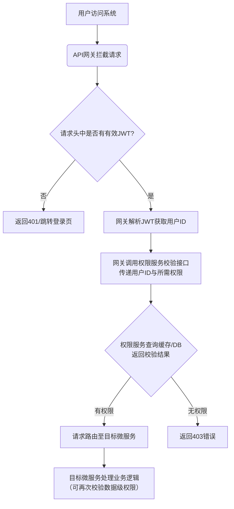

## 高校科研团队协作与成果管理平台产品设计文档

## 项目选题背景与意义

### 项目愿景

项目的愿景旨在成为高校科研团队的首选数字化协作中枢，通过技术手段提升科研创新效率，让知识的生产、沉淀与传承更加高效、有序。


### 目标用户 

- **导师/教授 (Principal Investigators, PIs):** 需要宏观掌控多个项目的进度、成果产出和团队成员表现。
- **团队负责人 (Team Leads):** 通常是博士后或博士生，负责具体项目的任务分解、分配和日常协作推动。
- **研究生/本科生 (Student Researchers):** 项目的主要执行者，需要清晰的任务指引、便捷的协作工具和规范的成果归档方式。
- **科研内容管理员 (Lab Administrators):** 负责团队人员管理、项目资料归档与 institutional reporting。


### 市场/业务痛点

当前，高校科研团队的协作管理模式普遍落后于数字化时代的发展，严重依赖零散的通用工具组合，导致了一系列亟待解决的核心痛点：

1. **协作碎片化，信息孤岛严重：** 团队沟通用微信群/QQ群、文件共享用公共网盘/U盘、任务跟踪用Excel/便签、论文撰写靠邮件往来。这种“工具混搭”导致信息分散在不同角落，人员更替时极易造成关键上下文和资料的丢失，历史决策和讨论过程无从追溯。
2. **成果管理无序，知识资产流失：** 科研产出的最终形态（如论文、代码、数据、报告）多以文件形式散落在个人电脑中，缺乏统一、结构化的归档与管理。这不仅使得团队知识资产无法有效沉淀和复用，也为成果统计、申报和评奖带来了巨大的管理成本。
3. **流程效率低下，自动化程度不足：** 项目立项、任务分配、成果评审等流程多靠人工线下推动，缺乏标准化、自动化的线上流程。成员无法清晰感知任务优先级和进度，负责人需耗费大量精力进行人工同步和催办，沟通成本极高。
4. **新人融入成本高：** 新成员加入项目组时，缺乏一个集中的平台来了解项目历史、技术栈、相关成果和知识文档，需要漫长时间进行“口口相传”的融入，降低了团队的整体敏捷性。


### 解决方案与产品价值

“智研”平台旨在针对上述痛点，为科研团队提供一个**一体化、规范化、智能化**的专属协作与知识管理解决方案。我们的核心价值体现在：

- **对于科研人员（用户价值）：**
  - **提升协作效率：** 在一个平台内完成沟通、任务管理、文档编写和文件共享，减少上下文切换，让研究人员更专注于科研本身。
  - **固化知识资产：** 将科研过程产生的所有智力成果（代码、数据、论文、报告）有序沉淀为可检索、可复用的团队知识库，形成宝贵的数字资产。
  - **赋能科研管理：** 为团队负责人和导师提供清晰的项目全景视图和量化数据支持，实现更精细化的过程管理和人才评估。
- **对于团队与实验室（业务价值）：**
  - **降低管理成本：** 数字化、标准化的流程减少了低效的人工操作，自动化通知和提醒降低了管理开销。
  - **保障知识传承：** 无论人员如何流动，项目资料和核心知识均得以完整保留，保障了研究工作的连续性和可持续性。
  - **增强团队竞争力：** 高效的协作模式和强大的知识沉淀能力，有助于团队更快地产出高质量成果，提升学术影响力。


### 技术战略与前瞻性

本项目采用**微服务架构**进行构建，这不仅是一次技术实践，更是为产品未来的发展奠定坚实的技术基础：

- **高可扩展性 (Scalability):** 随着团队数量和用户规模的增长，以及日后可能出现的需求更改，微服务载核心服务（如成果检索、消息通知）可以独立地进行水平扩展，而且也可以进行其他模块的快速扩展。
- **技术灵活性 (Flexibility):** 服务间解耦允许我们为不同场景选择最合适的技术（如用Elasticsearch处理搜索，用Redis处理缓存），并易于集成AI等前沿技术（如RAG应用）。
- **高可用性与可维护性 (Maintainability):** 单个服务的故障不会导致整个系统崩溃。独立的团队可以并行开发、测试和部署不同服务，极大提升开发效率。
- **展示技术实力：** 该架构充分体现了对现代分布式系统、云原生技术栈和DevOps理念的深入理解和实践能力。


## 项目核心功能模块规划

### 用户与权限服务

#### 模块功能定位

整个平台的**身份认证与权限基石**。本服务是整个平台的**认证授权中心（Auth Center）**。它负责所有用户身份的合法性验证，并为用户访问平台资源、执行操作提供统一的权限管控。其核心目标是**确保正确的人，以正确的角色，访问正确的资源**，实现师生账号的管理。

**用户故事**：

- **作为一名新入学的研究生**，我希望通过我的学校邮箱进行注册和验证，以便快速加入我导师的科研团队，开始我的研究工作。
- **作为一名团队负责人**，我希望能够管理我团队内的成员角色（如设置为“开发”或“文档”角色），以便控制他们对项目敏感操作的权限。
- **作为一名通用成员**，当我忘记密码时，我希望可以通过邮箱安全地重置我的密码，以便重新获得账户的访问权限。
- **作为一名系统管理员**，我希望有一个统一的界面来管理所有用户账户和平台级的角色权限，以便维护系统的秩序和安全。


#### 模块拥有的功能和解决的需求

- **用户注册**：
  - **需求**：解决“身份初始化管理”痛点，确保用户身份真实可溯。
  - **所有功能**：采用“**邮箱（域名可白名单校验）** + **验证码**”机制注册。用户需设置密码（6-16位，数字、字母或组合）并填写必填的基础信息（如姓名、单位）。
- **用户登录**：
  - **需求**：解决“安全便捷访问系统”的需求。
  - **所有功能**：支持“邮箱+密码”，“用户名+密码”等多种方式登录。未来可能接入学校的管理模块或者微信等第三方便捷登录，实现快速登录。提供“**记住我**”功能（基于Refresh Token实现长效会话）和勾选同意协议的可选项。可能根据需要实现令牌二次登陆验证的功能
- **密码管理**
  - **需求**：解决“账户找回”痛点，保障账户安全。
  - **所有功能**：提供“忘记密码”流程，通过邮箱验证身份后，允许用户重置密码。
- **角色权限系统和权限认证 **
  - **需求**：解决“精细化权限管控”的核心痛点，避免越权操作，实现什么人做什么事情的角色权限实现。并且为其他所有微服务提供统一的权限查询接口。
  - **所有功能**：实现基于角色的访问控制（RBAC）。
    -  **角色 (Role)**：定义一组权限的集合，如 `超级管理员`、`导师`、`团队负责人`、`普通成员`。
    -  **权限 (Permission)**：对应的权限应该对应其定义具体的操作，如 `project:delete`（删除项目）、`wiki:edit`（编辑Wiki）应该具有权限不同操作程度不同的功能。
    - **用户分配角色**：一个用户可拥有多个角色，其在项目/团队中的角色决定了其操作权限。
    - **权限认证**：本服务暴露接口，供API网关或其他服务查询“**某用户是否拥有执行某操作的权限**”。
- **JWT令牌管理**
  - **需求**：解决“服务无状态化”和“用户身份标识”问题。
  - **所有功能**：用户登录成功后，本服务签发JWT令牌。令牌中包含用户ID、角色等信息。后续请求凭此令牌访问系统。支持令牌失效（如登出后失效，再登入则生效）


#### 模块的流程

本服务的核心流程贯穿用户从进入平台到进行各项操作的始终，是系统安全与秩序的保障。其主要流程如下图所示



流程分为如下流程，每一个流程的步骤如下

- **用户注册与初始化流程**

  > 1. 用户访问注册页面。
  > 2. 前端：用户填写邮箱，点击「发送验证码」。
  > 3. 后端：权限服务生成随机验证码，并将其与邮箱关联后存入Redis（设置5分钟有效期）。
  > 4. 后端：调用邮件服务（如通过RabbitMQ异步解耦）发送验证码邮件。
  > 5. 前端：用户填写验证码、密码及其他信息，点击「注册」。
  > 6. 后端：校验验证码（从Redis中比对）和邮箱格式（可选白名单校验）。
  > 7. 后端：返回注册成功信息。
  > 8. 前端：提示用户注册成功，并引导至登录页。

- **用户登录与令牌签发流程**

  > 1. 用户访问登录页面。
  > 2. 前端：用户输入邮箱和密码，点击「登录」。
  > 3. 后端：权限服务根据邮箱从MySQL中查询用户信息。
  > 4. 后端：使用BCrypt比对用户输入的密码和数据库中存储的加密密码。
  > 5. 后端：密码正确后，根据用户信息（ID、角色等）使用JWT库（如auth0）生成Access Token和Refresh Token。
  > 6. 后端：将Refresh Token存入数据库或Redis（关联用户ID），以备后续刷新使用。
  > 7. 后端：将生成的Tokens返回给前端。
  > 8. 前端：将Access Token存储在本地（如Vuex/Pinia + localStorage），并在后续所有请求的HTTP Header（Authorization: Bearer <token>）中携带。

- **权限校验流程**

  此流程发生在用户每次访问受保护接口时，主要由**API网关**和**权限服务**协同完成。

  > 1. 用户从前端发起请求（如创建项目）。
  > 2. 请求首先到达API网关。
  > 3. 网关过滤器拦截请求，并提取HTTP Header中的JWT Token。
  > 4. 网关验证JWT签名是否有效、是否过期。
  >    - 若无效或过期，直接返回401 Unauthorized。
  > 5. 网关解析JWT，提取其中的用户ID（subject）和权限信息（claims）。
  > 6. 网关根据请求的路径和方法，映射到对应的权限标识符（如`project:create`）。
  > 7. 网关通过Feign调用权限服务的权限校验接口，传入用户ID和权限标识符。
  > 8. 权限服务接收到请求后，查询MySQL数据库，根据用户的所有角色计算出其拥有的所有权限列表，并缓存到Redis中。
  > 9. 权限服务将校验结果（true/false）返回给网关。
  > 10. 网关根据结果：
  >     - 若有权限，则将请求路由到相应的微服务（如项目与团队管理服务）。
  >     - 若无权限，则返回403 Forbidden。

- **Token刷新流程**

  > 1. 前端检测到Access Token即将过期或已过期。
  > 2. 前端使用仍在有效期内的Refresh Token调用权限服务的刷新接口。
  > 3. 后端：校验Refresh Token的有效性（检查签名和有效期）并查询其在数据库/缓存中是否存在（防止已被注销）。
  > 4. 后端：校验通过后，生成新的Access Token和可选的新的Refresh Token。
  > 5. 后端：使旧的Refresh Token失效（删除），存储新的Refresh Token。
  > 6. 后端：将新的Tokens返回给前端。
  > 7. 前端：更新本地存储的Tokens。


#### 模块的技术选型

- **核心框架**：以微服务 Spring Cloud 为基础，在本模块中使用 Spring Boot 作为核心框架

- **安全框架**：

  - **Spring Security** 
    - **对应的需求：** 实现复杂且安全的自定义认证流程（邮箱+验证码）、密码加密、方法级权限控制。提供了完整的认证和授权抽象接口，可以方便地集成JWT、RBAC模型，免去重复造轮子。

  - **JWT** (Java JWT库， `auth0` )
    - 实现服务无状态化，避免集群下的Session同步问题；为API网关提供轻量级的用户身份凭证。解决Token中包含用户基本信息，网关和服务无需频繁查询数据库即可解析身份，

- **数据持久化:** **Spring Data JPA** (ORM层) + **MySQL** (业务数据存储)

  - **需求：** 安全、可靠地存储用户 credentials、角色关系等核心数据，并要求强一致性，并且高效、可靠地进行用户、角色等数据的增删改查。 简化数据访问层代码，提高开发效率，内置乐观锁等功能提升数据一致性。

- **缓存：** **Redis** 

  - 需求：缓存用户权限数据，避免每次校验都查询数据库。验证码需短期有效且验证后立即失效，所以存储验证码（Key:邮箱, Value:验证码），并设置自动过期。实现Token黑名单或管理Refresh Token，存储已注销但未过期的Token，实现即时失效。

- **服务通信：**本服务主要作为**被调用方**，把提供权限验证接口暴露，可使用 **Spring WebFlux** 或 **Spring MVC** 暴露API供其他模块调用验证


#### 界面原型与交互说明

**界面原型：**

- **注册页:** 表单包含邮箱、验证码、密码、确认密码、姓名等字段。有“发送验证码”按钮，成功后提示“注册成功，请登录”。
- **登录页:** 经典的表单，包含邮箱、密码、“记住我”复选框、“忘记密码”链接和“登录”按钮。登录成功后跳转至首页。
- **忘记密码页:** 输入邮箱并发送验证码，验证通过后进入重置密码页面。

**交互逻辑:**

- 所有前端页面在调用API时，必须在请求头中携带 JWT Token（登录后获取）。
- 前端在接收到 `401 Unauthorized` 状态码时，应自动跳转至登录页。
- 前端在接收到 `403 Forbidden` 状态码时，应显示“权限不足”提示页。


#### 接口设计

1. **POST /api/auth/register** - 用户注册
   - Request Body: `{ "email": "user@university.edu", "code": "123456", "password": "***", "name": "张三" }`
   - Response: `201 Created` + `{ "id": 1, "email": "..." }`
2. **POST /api/auth/login** - 用户登录
   - Request Body: `{ "email": "user@university.edu", "password": "***", "rememberMe": true }`
   - Response: `200 OK` + `{ "token": "jwt-token-string", "refreshToken": "refresh-token-string", "userInfo": { ... } }`
3. **POST /api/auth/refresh** - 刷新Token
   - Request Body: `{ "refreshToken": "refresh-token-string" }`
   - Response: `200 OK` + `{ "token": "new-jwt-token-string" }`
4. **GET /api/users/me** - 获取当前用户信息
   - Headers: `Authorization: Bearer <jwt-token>`
   - Response: `200 OK` + 用户详细信息（含角色列表）
5. **POST /api/auth/check-permission** - **(内部接口)** 权限校验
   - 消费者：API网关或其他微服务
   - Request Body: `{ "userId": 123, "permission": "project:delete" }`
   - Response: `200 OK` + `{ "hasPermission": true }`


### 项目与团队管理服务

#### 模块功能定位

本服务是平台的**协作关系组织与执行引擎**。它负责将人员（团队）、任务（执行）和目标（项目）有机地结合起来，为科研活动提供一个结构化的在线协作环境。其核心目标是**明确权责、透明流程、高效协同，确保每一个科研项目都能有序推进、成果可期**。

**用户故事 (User Stories):**

- **作为一名导师**，我希望创建一个新的科研项目，指定负责人，并能够快速看到我名下所有项目的进展概览，以便宏观把控。
- **作为一名团队负责人**，我希望将项目目标分解为具体的任务，并清晰地指派给团队成员，设置优先级和截止日期，以便跟踪执行情况。
- **作为一名团队成员**，我希望在一个清晰的列表中看到所有分配给我的任务及其优先级，并能方便地更新任务状态（进行中、已完成），减少不必要的同步会议。
- **作为一名新加入实验室的学生**，我希望在“项目广场”中看到所有公开招募成员的项目，并能申请加入我感兴趣的项目，以便快速融入团队。
- **作为一名项目负责人**，我希望能够管理团队成员，处理他们的加入申请，并能为他们分配在项目中的不同角色（如开发、写作、实验），明确分工。


#### 模块拥有的功能和解决的需求

- **项目全生命周期管理**：解决“项目管理工具混乱”和“流程效率低下”的痛点。支持项目的**创建、编辑、状态流转（立项中、进行中、已结题、已归档）、归档/删除**。项目信息包括名称、描述、周期、负责人、成员、研究方向等。
- **任务管理与协作**：解决“任务跟踪靠Excel/便签”和“进度不透明”的痛点，是驱动项目执行的核心。能够进行任务的创建和分配，可创建任务，指定标题、描述、**执行者（仅限本项目成员）**、优先级（高/中/低）、截止日期。而且支持对任务状态进行跟踪，执行者可更新任务状态（如：未开始、进行中、阻塞、已完成）。并且拥有良好的视图，方便可视化管理和筛选。
- **精细化团队管理**：解决“人员更替导致资料丢失”和“权责不清”的痛点。能够通过链接或搜索邀请成员，或处理用户的加入申请。在项目内为成员分配角色（如：负责人、核心成员、参与者），**不同角色对应不同的操作权限**（需与权限服务联动）。并且拥有良好的视图， 清晰展示所有团队成员及其角色。
- **项目广场**：解决“新人融入成本高”和“项目信息不对称”的痛点。能够展示所有设置为“公开”的项目，支持按各种类型进行筛选。学生可浏览并申请加入感兴趣的项目，负责人可处理申请。


#### 模块的流程

- **项目创建与初始化流程：**

  > 1. 用户（通常为导师或项目负责人）点击「创建项目」。
  > 2. 前端：用户填写项目基本信息（名称、描述、起止时间等），并设置项目 visibility（公开/私有）。
  > 3. 后端：服务在MySQL中创建项目记录，创建者自动成为项目负责人并被加入项目团队。
  > 4. 后端：可选地，自动在“成果与知识库服务”中为该项目创建一个初始的Wiki空间。
  > 5. 前端：提示创建成功，并进入项目详情页。

- **任务分配与状态更新流程**:

  > 1. 在项目内，负责人点击「创建任务」。
  > 2. 前端：负责人填写任务信息，并从当前项目成员列表中选择「执行者」。
  > 3. 后端：服务将任务数据持久化到MySQL。
  > 4. 后端：发布一个“任务已创建”或“任务已指派”的事件到消息队列（如RabbitMQ）。
  > 5. 【消息服务】消费该事件，向被指派的执行者发送站内信或邮件通知。
  > 6. 执行者看到通知后，进入任务列表，开始工作。
  > 7. 执行者完成任务后，更新任务状态为“已完成”。
  > 8. 后端服务更新数据库，并可再次发布“任务已完成”事件，通知任务创建者。

- **成员加入与角色分配流程**：

  > 1. 学生用户在「项目广场」浏览公开项目，点击「申请加入」。
  > 2. 后端：服务生成一条申请记录，状态为“待处理”。
  > 3. 项目负责人收到待处理申请的通知（通过消息服务）。
  > 4. 负责人进入团队管理页面，看到申请列表，选择“同意”或“拒绝”。
  > 5. 若同意：
  >    a. 后端服务将该用户加入项目团队，并赋予默认角色（如“参与者”）。
  >    b. 发布“用户已加入项目”事件。
  >    c. 【消息服务】通知申请者已通过。
  >    d. 【权限服务】可能需更新该用户在此项目上下文中的权限。


#### 模块的技术选型

- **Spring Boot**：微服务开发基本框架，保证技术栈统一和开发效率，能够快速构建独立、可部署的数据管理微服务，并且提供Web开发、依赖管理等全套基础功能。
- **MySQL**：关系型数据库，用于存储结构化元数据。可靠地存储成果的元信息（标题、作者、状态等）、Wiki文档的元信息（标题、创建者）以及各种关联关系。
- Redis：（可能使用）提升接口响应速度，特别是项目首页和任务看板等页面。
- **RabbitMQ**：消息队列，用于系统解耦。 将“任务创建”、“成员变动”等事件通知逻辑与核心业务逻辑解耦。 核心服务只负责发布事件，由专用的【消息服务】去处理复杂的通知发送（邮件、站内信），提升主服务稳定性和响应速度。
- **Spring Cloud OpenFeign**：虽然其他的 Spring Cloud 的微服务组件肯定要用到，但是这里单独提一下 Feign，在本模块服务间调用的部分尤其多，用的时候也比较多


#### 界面原型与交互说明

- **项目列表页**
  - **界面元素：**
    - 顶部导航栏：用户头像、通知铃铛、搜索框、创建项目按钮
    - 左侧菜单栏：【我的项目】【项目广场】【任务中心】【团队管理】
    - 主内容区：
      - 选项卡筛选：【全部】【进行中】【已归档】
      - 项目卡片列表：每个卡片显示项目名称、进度条、负责人、最近更新时间、成员头像组
      - “创建项目”按钮（浮动在右下角）
  - **交互逻辑：**
    - 点击“创建项目”弹出模态框，填写项目基本信息后提交，自动跳转到新项目详情页。
    - 点击项目卡片进入该项目详情页。
    - 支持按项目名称搜索、按状态筛选。
    - 鼠标悬停在成员头像上可查看成员姓名和角色。
- **项目详情页：**
  - **界面元素：**
    - 顶部：项目名称、状态标签、操作下拉菜单（编辑、归档、删除）
    - Tab页：【概览】【任务】【文档】【成员】【设置】
    - 右侧面板：项目进度概览、最近活动日志
  - **交互逻辑：**
    - 【概览】页显示项目描述、时间线、最近任务和成果摘要。
    - 【任务】页为任务看板视图（Kanban），支持拖拽任务状态变更。
    - 【文档】页集成Wiki页面树状导航和内容预览。
    - 【成员】页显示成员列表，支持邀请成员、修改角色、移出团队。
    - 【设置】页仅对负责人可见，可修改项目基本信息、可见性等
- **任务看板页：**
  - **界面元素：**
    - 列：TODO / IN PROGRESS / BLOCKED / DONE
    - 每个任务卡片显示：标题、指派者、优先级标签、截止日期
    - 支持每个列内滚动加载更多任务
  - **交互逻辑：**
    - 点击“+”号添加任务，弹出表单填写后自动出现在TODO列。
    - 拖拽任务卡片至其他列，自动更新任务状态。
    - 点击任务卡片弹出详情侧边栏，可编辑详细信息、添加评论。
- **项目广场页：**
  - **界面元素：**
    - 搜索框 + 筛选器（按研究方向、状态等）
    - 项目卡片列表，每张卡片显示项目名称、简介、招募状态、已有成员数
    - “申请加入”按钮
  - **交互逻辑：**
    - 点击“申请加入”后，系统向项目负责人发送通知。
    - 负责人可在【成员】页的“待处理申请”中审批。


#### 数据库表结构设计

这些都是初步进行设计

```sql
-- 项目表 (project)
CREATE TABLE `project` (
  `id` BIGINT PRIMARY KEY AUTO_INCREMENT,
  `name` VARCHAR(255) NOT NULL COMMENT '项目名称',
  `description` TEXT COMMENT '项目描述',
  `status` ENUM('PLANNING', 'ONGOING', 'COMPLETED', 'ARCHIVED') DEFAULT 'PLANNING' COMMENT '项目状态',
  `visibility` ENUM('PUBLIC', 'PRIVATE') DEFAULT 'PRIVATE' COMMENT '项目可见性',
  `start_date` DATE COMMENT '开始日期',
  `end_date` DATE COMMENT '预计结束日期',
  `created_by` BIGINT NOT NULL COMMENT '创建者ID',
  `created_at` DATETIME DEFAULT CURRENT_TIMESTAMP,
  `updated_at` DATETIME DEFAULT CURRENT_TIMESTAMP ON UPDATE CURRENT_TIMESTAMP,
  FOREIGN KEY (`created_by`) REFERENCES `user` (`id`)
) COMMENT '项目表';

-- 项目-成员关联表 (project_member) - 表示用户加入了哪个项目，以及是什么角色
CREATE TABLE `project_member` (
  `id` BIGINT PRIMARY KEY AUTO_INCREMENT,
  `project_id` BIGINT NOT NULL,
  `user_id` BIGINT NOT NULL,
  `role` ENUM('LEADER', 'MAINTAINER', 'MEMBER') NOT NULL DEFAULT 'MEMBER' COMMENT '在项目内的角色',
  `joined_at` DATETIME DEFAULT CURRENT_TIMESTAMP,
  FOREIGN KEY (`project_id`) REFERENCES `project` (`id`) ON DELETE CASCADE,
  FOREIGN KEY (`user_id`) REFERENCES `user` (`id`) ON DELETE CASCADE,
  UNIQUE KEY `uniq_project_user` (`project_id`, `user_id`)
) COMMENT '项目成员表';

-- 任务表 (task)
CREATE TABLE `task` (
  `id` BIGINT PRIMARY KEY AUTO_INCREMENT,
  `project_id` BIGINT NOT NULL COMMENT '所属项目ID',
  `title` VARCHAR(500) NOT NULL COMMENT '任务标题',
  `description` TEXT COMMENT '任务详情',
  `assignee_id` BIGINT COMMENT '指派给的用户ID（必须是项目成员）',
  `priority` ENUM('HIGH', 'MEDIUM', 'LOW') DEFAULT 'MEDIUM' COMMENT '优先级',
  `status` ENUM('TODO', 'IN_PROGRESS', 'BLOCKED', 'DONE') DEFAULT 'TODO' COMMENT '任务状态',
  `due_date` DATETIME COMMENT '截止日期',
  `created_by` BIGINT NOT NULL COMMENT '创建者ID',
  `created_at` DATETIME DEFAULT CURRENT_TIMESTAMP,
  `updated_at` DATETIME DEFAULT CURRENT_TIMESTAMP ON UPDATE CURRENT_TIMESTAMP,
  FOREIGN KEY (`project_id`) REFERENCES `project` (`id`) ON DELETE CASCADE,
  FOREIGN KEY (`assignee_id`) REFERENCES `user` (`id`),
  FOREIGN KEY (`created_by`) REFERENCES `user` (`id`)
) COMMENT '任务表';
```


#### 接口设计

这些都是初步进行设计

1. **POST /api/projects** - 创建项目
   - Headers: `Authorization: Bearer <token>`
   - Body: `{ "name": "AI助研平台开发", "description": "...", "visibility": "PRIVATE" }`
   - Response: `201 Created` + 项目详情
2. **GET /api/projects** - 获取我的项目列表
   - Query Params: `?status=ONGOING` (可选筛选)
   - Response: `200 OK` + 项目列表
3. **POST /api/projects/{projectId}/tasks** - 创建任务
   - Body: `{ "title": "设计数据库模型", "assigneeId": 123, "priority": "HIGH" }`
   - Response: `201 Created` + 任务详情
4. **PUT /api/tasks/{taskId}** - 更新任务状态
   - Body: `{ "status": "IN_PROGRESS" }`
   - Response: `200 OK` + 更新后的任务详情
5. **GET /api/projects/public** - 获取公开项目列表（项目广场）
   - Response: `200 OK` + 公开项目列表
6. **POST /api/projects/{projectId}/join-requests** - 申请加入项目
   - Response: `201 Created`
7. **POST /api/projects/{projectId}/members** - （负责人）添加成员
   - Body: `{ "userId": 456, "role": "MEMBER" }`
   - Response: `201 Created`


### 数据与模型仓库服务

#### 模块功能定位

本服务是平台的**知识资产沉淀与智能应用中心**。它远不止是一个文件存储库，而是一个对科研过程中产生的所有形式的成果（论文、代码、数据、模型、报告）进行**规范化采集、结构化存储、智能化处理、高效化检索**的系统。其核心目标是**将隐性知识显性化，将分散知识集中化，让知识资产为团队创造持续价值**。

**用户故事 (User Stories):**

- **作为一名刚接手新课题的研究生**，我希望在团队的知识库里快速搜索到相关的过往论文、实验报告和代码，以便快速了解项目背景，避免重复造轮子。
- **作为一名即将毕业的博士生**，我希望有一个统一的地方归档我所有的研究成果（论文、数据集、专利），并轻松生成一份我的成果清单，用于工作报告或求职。
- **作为一名团队负责人**，我希望对所有项目产出的成果状态（起草中、评审中、已发布）一目了然，并能方便地邀请其他成员对成果进行评审。
- **作为一名正在撰写论文的研究员**，我希望使用平台的AI助手，基于我们团队已发表的所有研究成果，来帮我快速梳理相关工作和生成初版的核心观点摘要。
- **作为一名实验员**，我希望将本次实验的原始数据和报告一键上传并关联到项目，确保数据不丢失且可被其他成员复现。


#### **模块拥有的功能和解决的需求**

- **多类型成果管理**
  - **需求**：解决“成果管理无序，知识资产流失”的核心痛点。
  - **所有功能**：支持创建多种类型的成果条目：
    - **论文** (标题、作者、期刊/会议、摘要、状态、DOI)
    - **专利** (专利号、发明人、申请日期)
    - **数据集** (描述、版本、格式、大小)
    - **模型文件** (框架类型、版本、用途)
    - **实验报告/技术文档** (关联Wiki)
    - 等等其他自定义条目的内容，并且支持保存为模板
- **成果状态流转与评审**
  - **需求**：解决“流程效率低下”痛点，实现线上规范化管理。
  - **所有功能**：实现成果生命周期的状态管理，**起草中 (Draft)** -> **评审中 (Under Review)** -> **已发布 (Published)**，并且支持添加评审意见、团队成员进行随时的评审。
- **统一文件存储与管理**
  - **需求**：解决“文件散落个人电脑”的问题，实现集中安全存储。
  - 所有功能：集成**对象存储（如MinIO）**，为每个成果提供统一的附件上传/下载功能。支持版本控制，避免文件覆盖
- **全局智能化搜索**：
  - **需求**：解决“信息孤岛”痛点，实现知识的高效复用。
  - **所有功能**：所有已发布的成果内容和Wiki文档都会被 **Elasticsearch** 自动索引。用户可以通过关键词、作者、类型等快速检索到全平台的相关知识。
- **团队wiki知识库：**
  - **需求：**解决“知识传承”和“新人融入成本高”的痛点。
  - **所有功能**：提供基于**Markdown**的文档编辑器，所有人都能编辑都能上传。支持文档树状结构组织、版本历史、差异对比、协作编辑（可通过WebSocket实现实时提示）。
- **AI赋能集成**:
  - 需求：提升平台智能化水平，减轻用户负担，挖掘知识深度价值
  - 所有功能：
    -  **AI辅助摘要与标签生成：** 用户上传论文或报告后，可调用AI服务自动生成摘要和3-5个关键词，自动填充表单。
    -  **AI助手（RAG应用）：** 在Wiki或成果页面侧边栏提供聊天窗口。用户可针对**当前项目或团队的知识库**进行提问，AI基于检索到的内容生成可靠回答，防止“胡编乱造”。


#### 模块的流程

流程分为如下流程，流程的每一步如下：

- **成果创建与发布流程**

  > 1. 用户在项目内点击「创建成果」。
  > 2. 前端：用户选择成果类型（如“论文”），填写表单（标题、作者等），并上传PDF附件。
  > 3. 后端：服务将元数据存入MySQL，并将文件上传至MinIO，返回文件链接存入数据库。
  > 4. （可选）用户点击「AI辅助」，前端调用AI服务，返回摘要和关键词并自动填充表单。
  > 5. 用户保存后，成果状态为「起草中」。
  > 6. 用户点击「提交评审」，状态变为「评审中」，并可@相关人员。
  > 7. 评审人收到通知（通过消息服务），可查看成果并添加评论。
  > 8. 创作者根据评审意见修改后，最终负责人点击「发布」，状态变为「已发布」，内容被Elasticsearch自动索引。

- **知识检索流程：**

  > 1. 用户在全局搜索栏输入关键词“Transformer”。
  > 2. 前端将请求发送至API网关。
  > 3. API网关将搜索请求路由到本服务。
  > 4. 本服务构建查询语句，请求Elasticsearch进行全文检索。
  > 5. Elasticsearch返回匹配的成果和Wiki文档列表（包含高亮片段）。
  > 6. 本服务对结果进行组装和权限过滤（如检查用户是否有权访问结果所在的项目）后返回给前端。
  > 7. 前端渲染搜索结果列表。

-  **AI助手问答流程**

  > 1. 用户在Wiki页面的AI助手窗口提问
  > 2. 前端将问题发送至本服务。
  > 3. 本服务将问题转换为查询语句，在Elasticsearch中检索相关的成果和Wiki片段。
  > 4. 本服务将检索到的相关片段（作为Context）和用户问题一起组装成Prompt，调用大语言模型（LLM）API（如OpenAI、通义千问）。
  > 5. LLM根据提供的Context生成一段专业、可靠的回答。
  > 6. 本服务将回答返回给前端，并可能附上引用的来源链接。
  > 7. 前端渲染AI的回答。


#### 模块的技术选型

- **Spring Boot**：模块内的核心框架依旧是基于Spring Cloud的Spring Boot，保证技术栈统一和开发效率，能够快速构建独立、可部署的数据管理微服务，并且提供Web开发、依赖管理等全套基础功能。
- **MySQL**：关系型数据库，用于存储结构化元数据。可靠地存储成果的元信息（标题、作者、状态等）、Wiki文档的元信息（标题、创建者）以及各种关联关系。
- **Elasticsearch**：分布式、高性能的全文搜索引擎，提供强大的模糊查询、高亮和聚合能力，实现海量成果和文档内容的**毫秒级高效检索**，支持复杂关键词查询。
- **MinIO**：高性能、云原生的**开源对象存储**，与Amazon S3 API兼容，易于部署和管理。能够安全、可靠、高效地存储和管理各种非结构化数据（PDF、代码zip、数据集等）。提供海量文件存储能力，支持文件版本控制、权限管理，与分布式架构天然契合。
- **OpenAI API / 本地LLM**：大语言模型，用于实现AI摘要生成和智能问答功能，提升平台价值。


#### 界面原型与交互说明

- **成果展示页：**
  - **界面元素：**
    - 顶部筛选栏：类型（论文/代码/数据集/模型/报告）、状态、关键词搜索
    - 列表/网格视图切换按钮
    - 每个成果项显示：类型图标、标题、作者、状态标签、最后更新日期
    - “新建成果”按钮
  - **交互逻辑：**
    - 点击“新建成果”弹出类型选择器，选择后进入表单页。
    - 支持批量操作（如批量发布、导出元数据）。
    - 点击成果项进入详情页。
- **成果详情页**
  - **界面元素：**
    - 顶部操作栏：【编辑】【提交评审】【发布】【下载附件】【AI辅助】
    - 元信息面板：作者、状态、创建时间、关联项目等
    - 附件列表：支持预览/下载/版本对比
    - 评审意见区：显示历史评论和评审状态
  - **交互逻辑：**
    - 点击“AI辅助”可自动提取摘要和关键词。
    - 附件上传支持拖拽和多文件选择。
    - 评审意见支持@成员并发送通知。
- **知识库页**:
  - **界面元素：**
    - 左侧树状导航栏：页面结构，支持折叠/展开
    - 右侧内容区：Markdown渲染面板 + 编辑按钮
    - 顶部版本历史按钮、协作编辑状态指示器（显示当前编辑者）
  - **交互逻辑：**
    - 点击树节点切换页面。
    - 点击“编辑”进入Markdown编辑器，支持实时预览。
    - 保存时触发乐观锁机制，若冲突提示用户解决差异。
    - 支持全文搜索（集成Elasticsearch）。
- **侧边栏集成AI聊天助手**
  - **界面元素：**
    - 固定在右侧的可折叠侧边栏
    - 聊天历史列表 + 输入框
    - 回答区域显示来源引用（可点击跳转）
  - **交互逻辑：**
    - 输入问题后，调用RAG流程，返回基于知识库的答案。
    - 支持追问，上下文保持在当前会话中。
    - 回答中提到的成果或Wiki页面可一键跳转。


#### 数据库表结构设计

```sql
-- 成果主表 (artifact)
CREATE TABLE `artifact` (
  `id` BIGINT PRIMARY KEY AUTO_INCREMENT,
  `project_id` BIGINT NOT NULL COMMENT '所属项目ID',
  `title` VARCHAR(500) NOT NULL COMMENT '成果标题',
  `type` ENUM('PAPER', 'PATENT', 'CODE', 'DATASET', 'MODEL', 'REPORT') NOT NULL COMMENT '成果类型',   $
  `description` TEXT COMMENT '成果描述',
  `status` ENUM('DRAFT', 'UNDER_REVIEW', 'PUBLISHED') DEFAULT 'DRAFT' COMMENT '状态',
  `created_by` BIGINT NOT NULL COMMENT '创建者用户ID',
  `created_at` DATETIME DEFAULT CURRENT_TIMESTAMP,
  `updated_at` DATETIME DEFAULT CURRENT_TIMESTAMP ON UPDATE CURRENT_TIMESTAMP,
  FOREIGN KEY (`project_id`) REFERENCES `project` (`id`) ON DELETE CASCADE,
  FOREIGN KEY (`created_by`) REFERENCES `user` (`id`)
) COMMENT '成果主表';

-- 成果附件表 (artifact_attachment)
CREATE TABLE `artifact_attachment` (
  `id` BIGINT PRIMARY KEY AUTO_INCREMENT,
  `artifact_id` BIGINT NOT NULL,
  `file_name` VARCHAR(255) NOT NULL,
  `file_key` VARCHAR(500) NOT NULL COMMENT '存储在MinIO中的唯一标识KEY',
  `file_size` BIGINT COMMENT '文件大小(字节)',
  `mime_type` VARCHAR(100) COMMENT '文件类型',
  `created_at` DATETIME DEFAULT CURRENT_TIMESTAMP,
  FOREIGN KEY (`artifact_id`) REFERENCES `artifact` (`id`) ON DELETE CASCADE
) COMMENT '成果附件表';

-- Wiki文档表 (wiki_page)
CREATE TABLE `wiki_page` (
  `id` BIGINT PRIMARY KEY AUTO_INCREMENT,
  `project_id` BIGINT NOT NULL,
  `title` VARCHAR(255) NOT NULL,
  `content` LONGTEXT COMMENT 'Markdown内容',
  `parent_id` BIGINT DEFAULT NULL COMMENT '父页面ID，用于构建树状结构',
  `version` INT DEFAULT 1 COMMENT '乐观锁版本号',
  `created_by` BIGINT NOT NULL,
  `updated_by` BIGINT NOT NULL,
  `created_at` DATETIME DEFAULT CURRENT_TIMESTAMP,
  `updated_at` DATETIME DEFAULT CURRENT_TIMESTAMP ON UPDATE CURRENT_TIMESTAMP,
  FOREIGN KEY (`project_id`) REFERENCES `project` (`id`) ON DELETE CASCADE,
  FOREIGN KEY (`parent_id`) REFERENCES `wiki_page` (`id`),
  FOREIGN KEY (`created_by`) REFERENCES `user` (`id`),
  FOREIGN KEY (`updated_by`) REFERENCES `user` (`id`)
) COMMENT 'Wiki文档表';
```


#### 接口设计

1. **POST /api/artifacts** - 创建成果
   - Headers: `Authorization: Bearer <token>`, `Content-Type: multipart/form-data`
   - Body: FormData包括元数据（JSON字符串）和文件流。
   - Response: `201 Created` + 创建的成果详情
2. **GET /api/artifacts?projectId=1&type=PAPER&keyword=transformer** - 检索/筛选成果
   - Response: `200 OK` + 分页的成果列表
3. **GET /api/search/global?q={keyword}** - 全局搜索（代理到Elasticsearch）
   - Response: `200 OK` + `{ "artifacts": [...], "wikis": [...] }`
4. **POST /api/ai/summarize** - AI生成摘要
   - Body: `{ "text": "..." }` // 或 `{ "fileId": 123 }`
   - Response: `200 OK` + `{ "summary": "...", "keywords": ["kw1", "kw2"] }`
5. **POST /api/ai/ask** - 向AI助手提问
   - Body: `{ "question": "我们团队在目标检测领域做过哪些工作？", "projectId": 1 }`
   - Response: `200 OK` + `{ "answer": "...", "sources": [...] }`
6. **PUT /api/wikis/{id}** - 更新Wiki（需处理并发）
   - Headers: `If-Match: <version_number>` // 基于版本号的乐观锁
   - Body: `{ "content": "...", "version": 2 }`
   - Response: `200 OK` 或 `409 Conflict` (如果版本冲突)